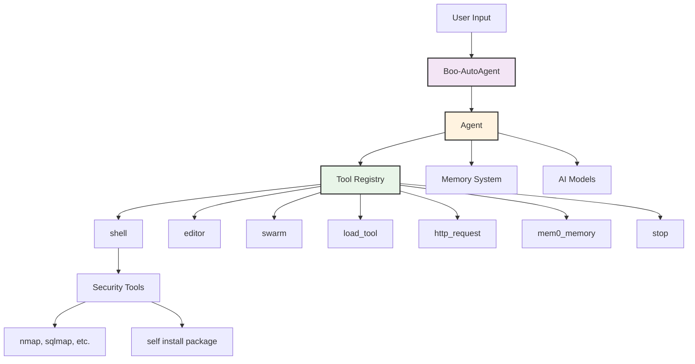
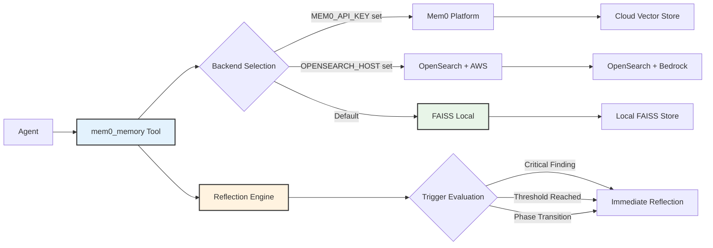
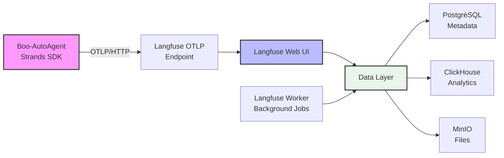

# Boo Documentation

---

## Overview

Boo is a next-generation autonomous security assessment platform designed for extensibility, transparency, and real-world operational scale. This documentation is a living, deeply cross-referenced, and example-rich resource for users, developers, operators, and researchers. It covers every aspect of Boo's architecture, operation, extension, and deployment, with a focus on practical, reproducible, and auditable security automation.

---

## Table of Contents

- [1. Introduction](#introduction)
- [2. Architecture](#architecture)
- [3. System Components](#system-components)
- [4. Memory System](#memory-system)
- [5. Prompt Management](#prompt-management)
- [6. Prompt Optimization](#prompt-optimization)
- [7. Interface and User Experience](#interface-and-user-experience)
- [8. Operations and Observability](#operations-and-observability)
- [9. Deployment](#deployment)
- [10. Configuration](#configuration)
- [11. Module Development](#module-development)
- [12. API Reference](#api-reference)
- [13. Security and Compliance](#security-and-compliance)
- [14. Troubleshooting](#troubleshooting)
- [15. Contributing](#contributing)
- [16. Changelog](#changelog)
- [17. Additional Resources](#additional-resources)

---

## 1. Introduction

Boo is an autonomous agent platform for penetration testing, red teaming, and security research. It leverages a single-agent meta-everything architecture, advanced memory systems, modular prompt management, and a real-time React-based terminal interface. Boo is designed for both production and research use, supporting cloud, local, and hybrid deployments.

---

## 2. Architecture

- **Single Agent Meta-Everything**: One agent orchestrates all operations, dynamically extending itself with meta-tools, sub-agents, and runtime code generation.
- **Strands Framework**: Provides the core agent loop, tool registry, memory integration, and event emission.
- **Tool Hierarchy**: Tools are loaded dynamically, with support for shell commands, custom Python tools, and swarm sub-agents.
- **Memory Integration**: Persistent, cross-operation memory with support for FAISS, OpenSearch, and Mem0 Platform.
- **Metacognitive Decision-Making**: The agent self-assesses confidence, adapts strategy, and triggers reflection and plan updates.

### Architecture Diagram



See [architecture.md](architecture.md) for more diagrams, flowcharts, and detailed design rationale.

---

## 3. System Components

- **Agent Core**: Implements the main reasoning loop, tool selection, and operation orchestration.
- **Memory System**: Handles evidence storage, plan management, and reflection triggers.
- **Prompt Management**: Modular system for loading, composing, and optimizing prompts.
- **Interface**: React-based terminal UI for real-time monitoring, configuration, and control.
- **Operation Plugins**: Extendable modules for domain-specific assessments (web, CTF, cloud, etc.).

---

## 4. Memory System

- **Backends**: FAISS (local), OpenSearch (cloud), Mem0 Platform (managed).
- **Evidence Categorization**: Structured metadata for findings, plans, reflections, vulnerabilities, exploits, and recon.
- **Reflection and Planning**: Automatic triggers for strategic pivots and plan updates.
- **Query Optimization**: Efficient retrieval and ranking of relevant memories.

### Memory System Diagram



See [memory.md](memory.md) for backend configuration, storage structure, and advanced usage.

---

## 5. Prompt Management

- **Module-Based**: Prompts are organized by module (general, ctf, etc.), with support for custom modules.
- **Dynamic Loading**: Prompts are loaded and composed at runtime based on operation context.
- **Tool Discovery**: Automatic detection and registration of available tools.
- **Report Generation**: Structured prompts for evidence-based report creation.

### Prompt Loader API

```python
class ModulePromptLoader:
    def load_module_execution_prompt(self, module_name: str) -> Optional[str]
    def load_module_report_prompt(self, module_name: str) -> Optional[str]
    def discover_module_tools(self, module_name: str) -> List[str]
    def get_available_modules(self) -> List[str]
    def validate_module(self, module_name: str) -> bool
```

See [prompt_management.md](prompt_management.md) for module structure, loader API, and extension patterns.

---

## 6. Prompt Optimization

- **Meta-Prompting**: Prompts are optimized using meta-level strategies for clarity, coverage, and performance.
- **Automatic Triggers**: Optimization runs on key events (new module, tool, or operation).
- **XML Tag Preservation**: Ensures compatibility with downstream systems.
- **Performance Metrics**: Tracks prompt effectiveness and agent performance.

See [prompt_optimizer.md](prompt_optimizer.md) for optimization flow, triggers, and best practices.

---

## 7. Interface and User Experience

- **Terminal UI**: Real-time event streaming, state management, and configuration via React Ink.
- **Event Protocol**: Structured JSON events for tool execution, reasoning, and metrics.
- **State Management**: Centralized, event-driven state with immutable updates.
- **Component Structure**: Modular, extensible UI components for terminal and web.

### Event Protocol Example

```typescript
interface BooEvent {
  type: string;
  timestamp: string;
  data: Record<string, any>;
}
```

See [terminal-frontend.md](terminal-frontend.md) for architecture diagrams, event protocol, and extension points.

---

## 8. Operations and Observability

- **Langfuse Integration**: Full-stack observability with trace collection, performance metrics, and automated evaluation.
- **Ragas Metrics**: Automated scoring of tool selection, evidence quality, methodology adherence, and overall test quality.
- **Real-Time Monitoring**: Live trace viewing, token usage, and cost tracking.
- **Automated Scoring**: Continuous feedback for agent improvement.

### Observability Stack Diagram



See [observability-evaluation.md](observability-evaluation.md) for stack diagrams, metric definitions, and troubleshooting.

---

## 9. Deployment

- **Docker Compose**: Production-ready deployment with full observability.
- **Standalone Docker**: Lightweight agent-only deployment.
- **Kubernetes**: Example manifests for cloud-native deployment.
- **Security Considerations**: Network isolation, resource limits, and key management.
- **Environment Variables**: Comprehensive list for all providers and backends.

See [deployment.md](deployment.md) for quick start, production setup, and troubleshooting.

---

## 10. Configuration

- **Persistent Config**: Stored in `~/.boo-autoagent/config.json`.
- **Model Providers**: AWS Bedrock, Ollama, LiteLLM, and more.
- **Memory Modes**: Auto, fresh, and custom.
- **CLI Flags**: Full list of command line options for agent and interface.

See [user-instructions.md](user-instructions.md) for configuration commands, flags, and best practices.

---

## 11. Module Development

- **Operation Plugins**: Create new modules for custom domains.
- **Module Structure**: YAML config, execution prompt, report prompt, and tool directory.
- **Loader API**: Methods for loading, validating, and discovering modules.
- **Report Integration**: Structured report generation for new modules.

See [../src/modules/operation_plugins/README.md](../src/modules/operation_plugins/README.md) for module API and examples.

---

## 12. API Reference

### Agent API

```python
from boo import create_agent, AgentConfig

agent, handler = create_agent(
    target="https://target.com",
    objective="Find SQL injection",
    max_steps=100,
    available_tools=["shell", "http_request"],
    op_id="OP_20250712_155132",
    model_id="claude-sonnet-4-5-20250929-v1:0",
    region_name="us-east-1",
    provider="bedrock",
    memory_path="./outputs/target/memory/",
    memory_mode="auto",
    module="general"
)
```

### Memory API

```python
from boo.memory import mem0_memory

# Store a finding
mem0_memory(
    action="store",
    content="[WHAT] SQL injection [WHERE] /login [IMPACT] Auth bypass [EVIDENCE] payload",
    user_id="boo_agent",
    metadata={"category": "finding", "severity": "critical", "confidence": "95%"}
)
```

### Prompt Loader API

```python
from boo.prompts import ModulePromptLoader

loader = ModulePromptLoader()
prompt = loader.load_module_execution_prompt("general")
tools = loader.discover_module_tools("general")
```

### Event Protocol

```json
{
  "type": "tool_start",
  "timestamp": "2025-12-10T07:00:00Z",
  "data": {
    "tool_name": "shell",
    "tool_input": {"command": "nmap -sV target.com"}
  }
}
```

---

## 13. Security and Compliance

- **Legal Notice**: Use only with explicit authorization. Unauthorized testing is illegal.
- **Responsible Disclosure**: Follow coordinated disclosure practices for vulnerabilities.
- **Compliance**: Supports audit logging, evidence retention, and data isolation.

---

## 14. Troubleshooting

- **Common Issues**: Docker, provider, and configuration errors.
- **Debug Commands**: Logs, trace viewing, and environment checks.
- **Support**: GitHub Issues and community forums.

---

## 15. Contributing

- **Style Guide**: Professional, technical, and example-rich documentation.
- **Code Examples**: Use real file paths and verified commands.
- **Diagrams**: Use Mermaid for architecture and flowcharts.
- **Cross-References**: Link related concepts and documents.
- **Verification**: All examples and configs must be tested.

---

## 16. Changelog

- See [../CHANGELOG.md](../CHANGELOG.md) for release history and major changes.

---

## 17. Additional Resources

- **Main Project README**: [../README.md](../README.md)
- **Source Code**: [../src/](../src/)
- **Operation Modules**: [../src/modules/operation_plugins/](../src/modules/operation_plugins/)
- **Community**: GitHub Issues, Discussions, and Security Advisories

---

## Documentation Status

This documentation is continuously updated to reflect the current implementation. Features marked as "future" or "planned" are explicitly noted. All examples and configurations are verified against the codebase.

---